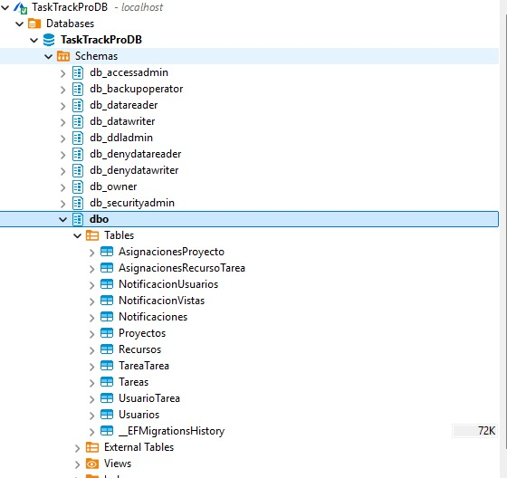
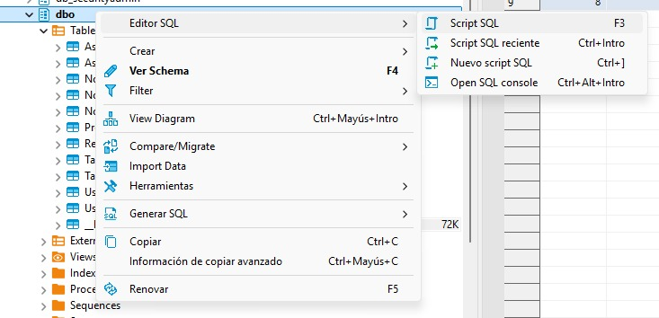

# Guía de instalación de **TaskTrackPro**

### 1. Descargar la última release disponible

### 2. Descomprimir el archivo `publish.rar` y entrar a la carpeta creada

### 3. Abrir Docker Desktop

### 4. Levantar el contenedor en tu cmd

```bash
docker compose up
```

### 5. Ejecutar `Presentacion.exe` dentro de la carpeta `publish`

### 6. Abrir **DBeaver**:

1. Crear una **nueva conexión**
2. Elegir **Azure SQL Server**
3. Completar con los siguientes datos:
    - **Host**: `localhost`  
    - **Database/Schema**: `TaskTrackProDB`  
    - **Nombre de Usuario**: `sa`  
    - **Contraseña**: `Contraseña123`  
    - Checkear las checkboxes de **Settings**

    

4. Click en **Probar Conexión**
5. Descargar todo lo que te pida
6. Finalizar
7. Navegar: `Databases -> TaskTrackProDB -> Schemas -> dbo`  

    

8. Hacer click derecho sobre `dbo -> Editor SQL -> Script SQL`

    

---

### 7. Volver a la carpeta del paso 2 y abrir uno de los siguientes scripts:

- `scriptDatosPreCargados.sql` si se desea arrancar la app con datos de prueba
- `scriptEmptyDB.sql` si se desea arrancar la app únicamente con el usuario admin

### 8. Copiar **TODO** el contenido del script y pegarlo en el editor de DBeaver abierto previamente

### 9. Seleccionar todo el código (`Ctrl + A`), hacer click derecho y ejecutar

### 10. En tu navegador, ir a:

```
http://localhost:5000
```

