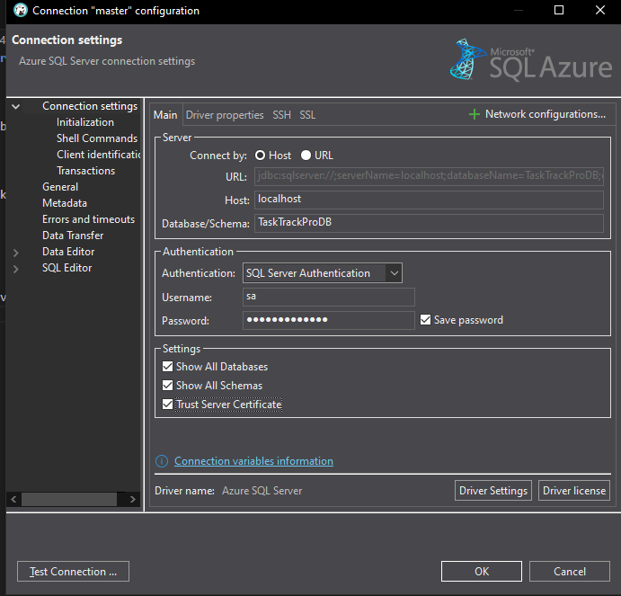

# Guia de instalación de TaskTrackPro

1- Descargar la ultima release disponible

2- Descomprimir el archivo "publish.rar" y entrar a la carpeta creada

3- Abrir Docker Desktop

4- Levantar el contenedor (docker compose up)

5- Ejecutar "Presentacion.exe" dentro de la carpeta "publish"

6- Abrir Dbeaver:
    1- "Nueva Conexión"
    2- Elegimos "Azure Sql Server"
    3- Completamos con los siguientas datos:
        "Host": localhost
        "Database/Schema": TaskTrackProDB
        "Nombre de Usuario": sa 
        "Contraseña": Contraseña123
        Checkear las checkboxes de "Settings"
        
    4- Click en "Probar Conexión"
    5- Descargar todo lo que te pida
    6- Finalizar
    7- Navegamos -> Databases -> TaskTrackProDB -> Schemas -> dbo
        
    8- Sobre dbo hacemos click derecho -> Editor SQL -> Script SQL
        
7- Volvemos a la carpeta del paso 2 y abrimos: 
    - scriptDatosPreCargados.sql si se desea arrancar la app con datos de prueba
    - scriptEmptyDB.sql si se desea arancar a app unicamente con el usuario admin
8- Copiamos TODO lo que posee ese script y lo pegamos en el editor de DBeaver abierto previamente
9- Seleccionamos todo el codigo (Ctrl + A), hacemos click derecho y ejecutamos.
